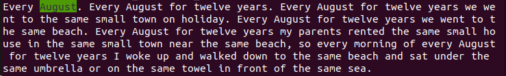
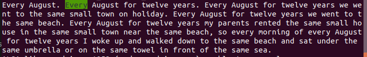

Example 'db' directory is already present with few words (to see the structure of the 'db' directory.)

1. download audio files from the link : `http://download.shtooka.net/eng-wcp-us_flac.tar`
2. unzip 'eng-wcp-us_flac.tar' in 'db' directory :  `tar -C db/ -xvf eng-wcp-us_flac.tar`
3. convert .flac files to .wav files : `python3 convert.py "db/flac/" "db/english_audio/"`
4. Run reader.py : `python3 reader.py "story.txt" "db/english_audio/"`

	View

	

	
